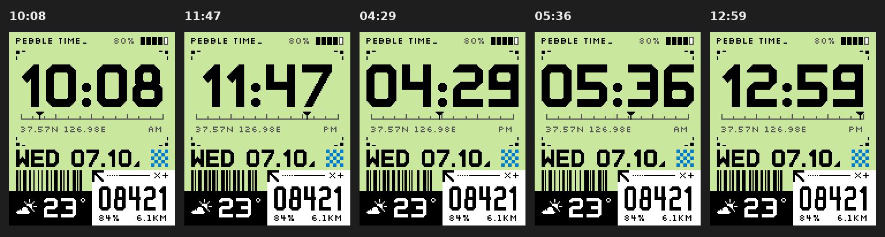

# TR-S 35 — Pebble Time 워치페이스

Pebble Time(basalt, 144×168, 64색)용 워치페이스. 게임 Marathon(Bungie)의 "그래픽 리얼리즘"(색 블록 콜라주, 기하학 도형, 산업용 라벨)을 참고하되 Bungie의 로고·문구·폰트·그래픽은 쓰지 않았다. 도형은 모두 코드로 그리고, 숫자 폰트도 직접 만들었다.


| 영역 | 내용 |
|---|---|
| 헤더 | 워치 이름 `PEBBLE TIME_`(커서), 배터리 % + 5칸. 폰 연결이 끊기면 이름 자리가 반전 태그 `NO LINK` |
| 시계 | 코너 마크 4개 안에 37px 숫자. 아래 눈금자 마커가 지금이 그 시간의 몇 분째인지 가리킴. 날씨를 받은 위치 `37.57N 126.98E`(없으면 펌웨어 버전), `AM`/`PM`/`24H` |
| 날짜 | `WED 07.10` + 직각삼각형 마크, 오른쪽 체커(테마의 유일한 포인트 색) |
| 바코드 | 실제로 스캔되는 Code 128. 내용은 현재 시각 `HHMM`(10:08이면 `1008`) |
| 날씨 | 블록 안 아이콘 + `23°` (단위 글자 없음, 단위는 설정에서). Open-Meteo, 폰 위치 기준, API 키 없음 |
| 걸음 | 흰 패널, 지시선 `↘ ····──── × +`, 5자리 걸음수, 목표 대비 %, 오늘 걸은 거리 |
| 흔들기 | 현재 꺼둠 (`src/c/main.c`의 `SHAKE_ENABLED 0`). 켜면 약 1초 동안 원·십자·방사선 오버레이와 두 칸 교차 |

## 1. 디자인

### 시안 반영 원칙

2차 시안(`docs/mockup-2.png`)을 기준으로 맞췄다. 구현을 시안과 픽셀 단위로 비교하면 시계 숫자 폭과 바코드(아래 "시안과 다른 점")를 빼고 모두 같다.

- **비율**: 시계 칸 85px(화면 절반), 날짜 18px, 아래 두 칸 48px.
- **색**: 바탕 1색 + 검정/흰 블록 + 진회색(보조 글자·눈금·빈 배터리 칸) + 포인트 1색(체커).
- **텍스트**: 의미 있는 정보만.
- **안티앨리어싱 없음**: 모든 그리기 함수가 `graphics_context_set_antialiased(ctx, false)`로 시작하고, 폰트는 픽셀 단위로 그려 1비트로 변환된다.
- **정렬**: 좌우 여백 6px(x=6..137, 72px 칸 안에서는 6..65). 시계 숫자는 잉크 기준 가운데.

2차 시안에서 바뀐 것 (구현에 반영):
- 폰트: `1`(깃발 모양과 줄기 위 모따기), `8`(위 고리가 좁고 허리가 들어감), 날짜 `W`·`1`, 걸음 `2`·`4`·`8`·`1`, 기온 `2`·`3`의 튀어나온 픽셀 정리
- 코너 마크의 작은 조각 3×2 → 3×1, 위치 1px 바깥
- 배터리 빈 칸: 회색 채움 → 회색 테두리
- 커서 `_` 1px 당김
- 바코드: 칸 가운데 → 왼쪽 여백(6px)에 맞추고 높이 16 → 18px, 검은 블록에 바로 붙음
- 날씨 아이콘: 시안의 해+구름 픽셀 그대로, 2px 아래로
- 기온: 2px 오른쪽, `°` 링을 숫자 뒤 4px 간격·숫자 윗선에 맞춤, 단위 글자(C/F) 삭제
- 걸음 칸 지시선: 세로 2px, 대각선 3px 두께, 실선이 `×`와 4px 떨어지게

시안과 다른 점 (의도적):
- **시계 숫자 폭 28 → 26px, 간격 6 → 5px.** 시안은 폭이 좁은 `1`이 들어간 `10:08` 기준이라, `04:29`처럼 넓은 숫자 4개가 오면 시계가 화면 끝(0~144px)까지 찼다. 26/5px면 어떤 시각이든 6~137px 안에 들어간다. 시안의 `0`·`8`은 가운데 두 열만 빼서 모따기·획은 그대로다. (`docs/screenshots/14-times.png`)
- **바코드 막대 하나.** 시안은 손으로 옮기면서 가운데 1px 공백이 하나 더 들어가 58px이고, 구현은 Code 128 규격대로 57px. 둘 다 `1008`로 읽힌다.

### 폰트

`tools/make_font.py`가 **TRS Grid** 픽셀 폰트를 크기별로 하나씩 만든다(Time 37px, Date 15px, Temp 17px, Steps 21px). 크기마다 획(7/3/3/3px)·모따기·간격을 픽셀 단위로 정하고, 픽셀 사각형으로 된 외곽선을 TrueType으로 저장해 Pebble 변환기가 정확히 같은 픽셀을 그린다(생성 후 FreeType으로 렌더링해 설계와 한 픽셀이라도 다르면 실패). 시안에 그려진 글자(`tools/mockup_glyphs.py`)는 시안 픽셀 그대로 쓰고, 나머지 글자(시계 2~7·9, 요일 글자 등)는 같은 규칙으로 생성한다. 작은 라벨은 **Silkscreen 8px** (OFL).

**KH Interference로 바꾸기**: KH Type의 상용 폰트(무료는 체험판)라 저장소에는 넣지 않는다. 파일이 있으면

```sh
make font FONT=~/Downloads/KHInterference-Bold.otf     # 걸음수용을 따로: NARROW=...
make demo
```

`resources/fonts/{time,date,temp,steps}.ttf`는 git이 무시한다. 빌드할 때 FreeType으로 숫자 높이·위치·오른쪽 여백을 다시 재서 정렬이 자동으로 맞는다(`wscript`의 `FM_*`). 되돌리기: `make font-reset`.

### 테마 (모두 Pebble 64색, `tools/palette_map.py`로 레퍼런스 색에서 매핑)


| # | 이름 | 바탕 | 블록 / 패널 | 포인트 |
|---|---|---|---|---|
| 0 | LIME (기본, 시안) | SpringBud `#AAFF00` | 검정 / 흰 | BlueMoon `#0055FF` |
| 1 | MINT | Celeste `#AAFFFF` | 검정 / 흰 | BlueMoon |
| 2 | ACID | 검정 | 라임 / 흰 | ElectricBlue |
| 3 | VIOLET | 검정 | LavenderIndigo / 흰 | SpringBud |
| 4 | SIGNAL | 흰 | 검정 / 라임 | BlueMoon |
| 5 | NULL | Folly `#FF0055` | 검정 / 흰 | 검정 |
| 6 | FLARE | ElectricUltramarine | 검정 / 라임 | Folly |

레퍼런스 색 매핑 예: 라임 `#C6FF33`→SpringBud(ΔE 12.5), 민트 `#CAEADA`→Celeste, 파랑 `#1D6FF9`→BlueMoon, 핫핑크 `#FF0961`→Folly(ΔE 6.7), 바이올렛 `#7D39EB`→LavenderIndigo.

배치 프리셋 3개는 모듈 크기가 같고 위치만 다르다: STACK(기본) / SWAP(두 칸 좌우 교체) / INVERT(칸 위, 시계 아래).

### 바코드

`src/c/barcode.c`가 Code 128 (Set C)을 직접 그린다: 시작 C, 숫자 2개씩, mod-103 체크, 정지. 1px 모듈로 숫자 4자리가 57px라 왼쪽 여백부터 6..62px에 들어간다. 에뮬레이터 화면을 `zbarimg`로 읽으면 `CODE-128:1008`이 나온다. 다른 내용으로 바꾸려면 `wx_update`의 `code` 한 줄(예: 날짜 `MMDD`). 걸음수 6자리는 68px이라 여백 없이 꽉 차서 권하지 않는다. 실제 휴대폰 스캔은 모듈이 약 0.22mm로 작아서 실기기에서 확인이 필요하다.

## 2. 개발 기반 선정

GitHub에서 시간·날씨·걸음수·설정 화면이 이미 있는 오픈소스 C 워치페이스를 찾아 비교했다.

| 후보 | 플랫폼 | 날씨 | 걸음 | 설정 | 라이선스 | 판단 |
|---|---|---|---|---|---|---|
| **[peerdavid/pebble-mesh](https://github.com/peerdavid/pebble-mesh)** | basalt·diorite·emery | Open-Meteo + 폰 GPS, 키 없음 | Health | Clay | Apache-2.0 | **선택** |
| [gerbert/grid](https://github.com/gerbert/grid) (//GRID) | emery·flint만 | Open-Meteo 등 여러 제공자 | Health | Clay | GPL-2.0 | basalt 미지원, 기능(알람·도플러 등)이 많아 덜어낼 게 많음 |
| [clach04/watchface_framework](https://github.com/clach04/watchface_framework) | 전 플랫폼 | 없음 | Health | Clay | Apache-2.0 | 깔끔한 뼈대지만 날씨를 새로 짜야 함 |
| (제외) TranquilMarmot/StyleTime | Fitbit | | | | | Pebble 아님 |
| (제외) astosia Elizabeth | | | | | | 소스 저장소를 찾지 못함 |

pebble-mesh를 고른 이유: 요구사항(basalt, Open-Meteo·폰 위치, Health 걸음수, 배터리, 블루투스 끊김, Clay)이 전부 이미 있고, 라이선스가 GPL 저장소에 넣기 쉬운 Apache-2.0이다.

가져온 것(구조와 방식) — 코드는 이 디자인에 맞게 다시 썼다:
- 워치 → 폰 `WEATHER_REQ` 요청, 폰 JS가 GPS → Open-Meteo → AppMessage로 응답하는 흐름
- AppMessage를 한 번에 하나만 보내는 JS 큐(`send`/`pump`) — 설정 저장과 날씨 전송이 부딪히지 않게
- Clay select 값(문자열)과 toggle(정수)을 워치에서 모두 받는 처리, 날씨 영구 저장 후 재시작 시 복원
- WMO 날씨 코드 → 아이콘 구간 나누기

바꾼 것: PDC 아이콘 대신 기본 도형으로 그린 날씨 아이콘, TextLayer 대신 모듈별 Layer 직접 그리기(레이아웃 프리셋·애니메이션 때문에), 역지오코딩(bigdatacloud) 제거, 기온을 섭씨×10 정수로 보내 단위 전환을 워치에서 처리(재요청 불필요).

## 3. 구조

```
src/c/main.c      서비스 구독(시간·배터리·연결·Health·탭), AppMessage, 흔들기 타이머
src/c/face.c      모듈별 그리기 (헤더/시계/날짜/날씨 칸/걸음 패널), 흔들기 오버레이
src/c/shapes.c    코너 마크, 눈금자, 체커, 직각삼각형, + ×, 날씨 아이콘(해+구름은 시안 비트맵)
src/c/barcode.c   Code 128 Set C
src/c/layout.c    배치 프리셋 3개
src/c/theme.c     테마 7개 (색 역할 8개)
src/c/state.c     설정·날씨 저장, 메시지 해석, 걸음수·거리, 기온·위치 포맷
src/pkjs/         날씨(Open-Meteo)·메시지 큐·Clay 설정 화면
tools/            make_font.py + mockup_glyphs.py, palette_map.py, emu_health_on.py, clay_drive.js, test_weather.js
```

## 4. 빠른 확인 환경

### PC 설치 (macOS / Linux, 한 번만)

```sh
uv tool install pebble-tool          # 또는: pipx install pebble-tool
pebble sdk install latest            # SDK + 에뮬레이터
# Linux는 에뮬레이터용 라이브러리:  sudo apt install libsdl2-2.0-0 libpixman-1-0 libglib2.0-0
cd pebble/trs35
npm install                          # Clay
```

### 에뮬레이터 미리보기

```sh
make emu        # = pebble build && pebble install --emulator basalt
make demo       # 시간 10:08 고정 + 샘플 날씨/걸음 (스크린샷용)
make shot       # docs/screenshots/latest.png
make config     # 에뮬레이터용 설정 화면을 브라우저로
pebble emu-tap --emulator basalt                    # 흔들기
pebble emu-battery --percent 15 --emulator basalt   # 배터리
pebble emu-bt-connection --connected no --emulator basalt
```

데모 빌드에서 테마·배치: `TRS_DEMO=1 TRS_THEME=1 TRS_LAYOUT=2 pebble build`.
에뮬레이터에서 "This app requires Pebble Health" 창이 뜨면 `make health` 후 다시 설치.

### 실제 워치에 명령 한 줄로 설치

1. 폰과 PC를 같은 Wi-Fi에 연결
2. 폰의 Pebble 앱 → 설정 → **개발자 연결(Developer Connection)** 켜기 → 표시되는 IP 확인
3. PC에서:

```sh
make phone PHONE=192.168.0.12        # 빌드 + 설치 + 로그
# 또는 IP를 환경변수로 두면 그냥 `pebble install`이 워치로 감
export PEBBLE_PHONE=192.168.0.12
pebble build && pebble install
```

## 5. 결과

- 시안과 구현: 맨 위 그림. 여러 시각: 
- 설정 화면(Clay): 
- 흔들기 애니메이션은 꺼져 있다. 다시 켜려면 `src/c/main.c`의 `SHAKE_ENABLED`를 1로, `src/pkjs/config.js`에 토글을 되돌리면 된다(16프레임 × 66ms, 3초 쿨다운, 배터리 10% 이하면 재생 안 함).

## 6. 실기기 테스트 체크리스트

- [ ] 걸음수·거리가 실제 값으로 오르는지 (basalt 에뮬레이터는 걸음 주입을 지원하지 않아 데모 값으로만 확인)
- [ ] 폰 GPS 권한 허용 후 실제 Open-Meteo 날씨가 오는지 (`make phone` 로그에 `open-meteo: 18.5C code 3`)
- [ ] 폰 블루투스 끄기 → `NO LINK` + 진동, 다시 켜면 복귀
- [ ] 바코드가 휴대폰 스캐너로 읽히는지
- [ ] 실제 화면에서 라임/민트 바탕이 너무 바래 보이지 않는지

## 부록: 이 저장소를 만든 클라우드 환경에서의 SDK 구성

작업한 클라우드 환경은 `sdk.repebble.com`과 `api.open-meteo.com`이 네트워크 정책으로 막혀 있어서 공식 SDK 대신 다음처럼 구성했다. 일반 PC에서는 위의 `pebble sdk install latest`면 된다.

- 툴체인·QEMU: GitHub [coredevices/PebbleOS-SDK](https://github.com/coredevices/PebbleOS-SDK) 릴리스 번들
- 앱 SDK + basalt 에뮬레이터 펌웨어: [coredevices/PebbleOS](https://github.com/coredevices/PebbleOS) `v4.9.60`(snowy 보드가 남아 있는 버전)을 `./waf configure --board=snowy_bb2 --qemu --nojs --release && ./waf build qemu_image_micro qemu_image_spi`로 빌드한 뒤 `pebble sdk install --tintin <경로>`
- 날씨 경로는 JS의 API 주소만 로컬 목 서버로 바꾼 임시 사본으로 끝까지 확인, 설정 화면은 `tools/clay_drive.js`(헤드리스 Chromium)로 `pebble emu-app-config`를 구동

## 라이선스와 출처

- 이 워치페이스 코드와 TRS Grid 폰트: 저장소 라이선스(GPL-3.0)
- 구조 참고: [pebble-mesh](https://github.com/peerdavid/pebble-mesh) (David Peer, Apache-2.0)
- 날씨: [Open-Meteo](https://open-meteo.com) (CC BY 4.0, 비상업 무료)
- Silkscreen (Jason Kottke) — SIL OFL 1.1, `resources/fonts/OFL-silkscreen.txt`
- KH Interference는 포함하지 않는다(KH Type 라이선스). Marathon / Bungie의 상표·로고·폰트·그래픽도 포함하지 않으며 레퍼런스 이미지는 저장소에 넣지 않았다.
