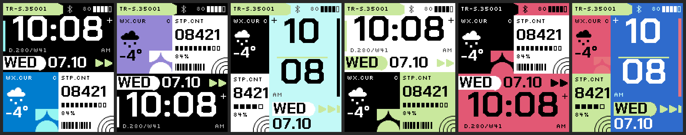
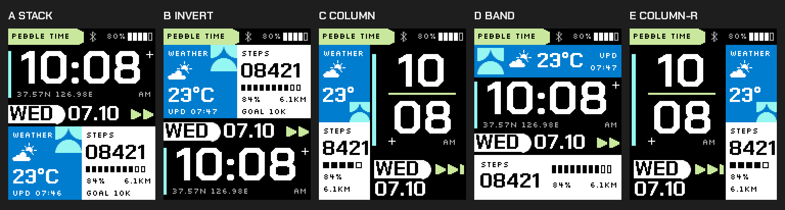
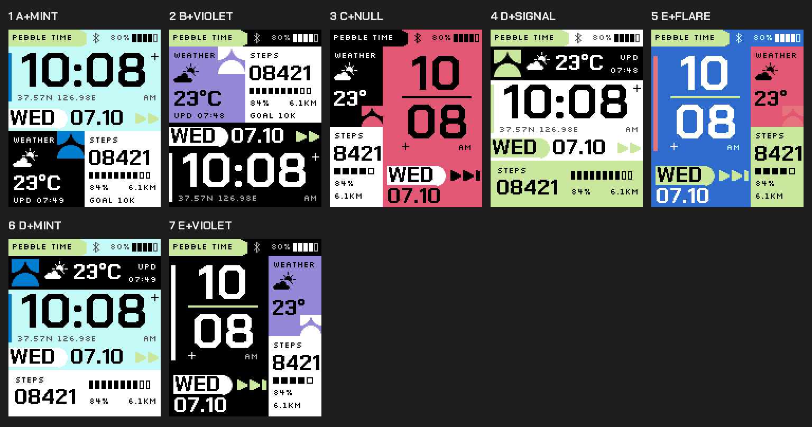
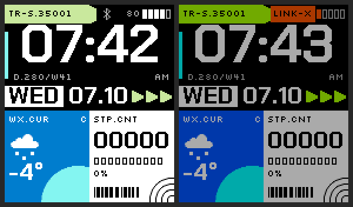
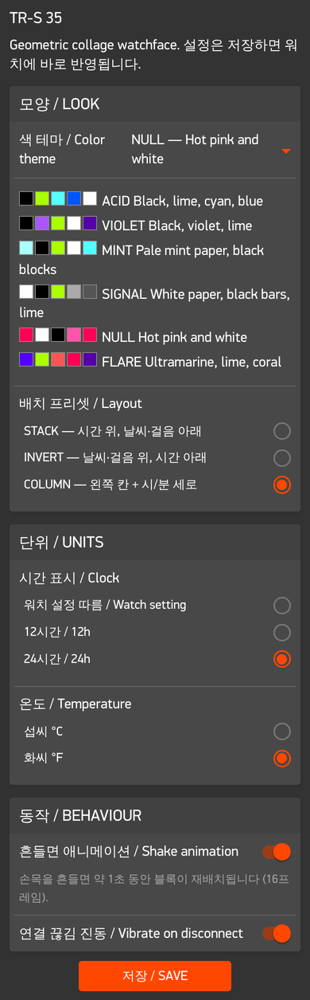
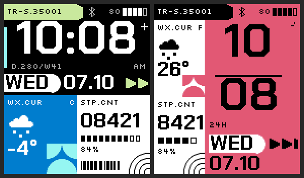

# TR-S 35 — Pebble Time 워치페이스

Pebble Time(basalt, 144×168, 64색)용 워치페이스. 게임 Marathon(Bungie)의 "그래픽 리얼리즘" 느낌(색 블록 콜라주, 굵은 기하학 도형, 산업용 코드 라벨)을 참고했지만, Bungie의 로고·"MARATHON" 문구·전용 폰트·원본 그래픽은 쓰지 않았다. 도형은 모두 코드로 직접 그렸고 폰트는 OFL 무료 폰트다.



| 표시 | 내용 |
|---|---|
| 헤더 | 워치 이름(`PEBBLE TIME` / `TIME STEEL`, 워치 모델에서 읽음), 블루투스, 배터리 % |
| 시간 | 큰 숫자(Chakra Petch Bold 46px), 12/24시간, AM/PM·24H, 날씨 기준 위치 `37.57N 126.98E`(위치 없으면 펌웨어 버전) |
| 날짜 | 반원 캡이 달린 요일 탭 + `07.10` |
| 날씨 | 현재 기온(`23°C`) + 상태 아이콘(직접 그린 도형) + 마지막 갱신 시각 `UPD 07:30`. Open-Meteo, 폰 위치 기준, API 키 없음. 3시간 넘으면 `WEATHER OLD` |
| 걸음수 | Health API, 5자리(`08421`), 목표 10,000보 진행 눈금 + %, 오늘 걸은 거리 `6.1KM`, `GOAL 10K` |
| 배터리 | 5칸 + 숫자, 20% 이하면 경고색, 충전 중 `+` |
| 블루투스 | 연결: 룬 아이콘 / 끊김: `LINK-X` 경고 블록 + 진동(옵션) |
| 흔들기 | 손목을 흔들면 약 1.1초 블록 재배치 애니메이션 |

## 1. 레퍼런스 분석 → 디자인 요소

받은 레퍼런스 6장(Marathon 포스터 콜라주 2장, 팔레트 시트, 라임 에디토리얼 레이아웃, 핑크 "null" 포스터 등)에서 뽑은 요소와 워치페이스에 옮긴 방식:

| 레퍼런스 요소 | 워치페이스에서 |
|---|---|
| 맞붙은 색 블록 콜라주(흰 패널+검정 글자, 라임·청록·파랑 라벨 블록) | 모듈(헤더/시간/날짜/날씨 칸/걸음 칸)을 틈 없이 붙여 배치, 칸마다 다른 블록색 |
| 회색 1/4원 타일 패턴(4개가 모여 잎·원 모양) | 날씨 칸 오른쪽 아래 2×2 1/4원 블록 (`shapes_quarter_tiles`) |
| 큰 반원 | 요일 탭의 반원 캡 (`shapes_half_disc`) |
| 삼각형 패턴 필드 | 날짜 줄 끝의 삼각형 열 (`shapes_triangle_row`) |
| 산업용 코드 라벨 `TR - S.35001`, 좌표 `37.5665° N — 126.9780° E` | 의미 없는 코드 대신 워치 정보를 같은 말투로: `PEBBLE TIME`, `37.57N 126.98E`, `UPD 07:30`, `GOAL 10K`, `6.1KM`, `80%`, `LINK-X` — 픽셀 폰트 Silkscreen 8px |
| `+` 마크, 작은 검정 사각형, 눈금 | 시간 칸 `+`, 걸음 진행 눈금 |
| 각진 블록 글자, 모노스페이스 숫자 | Chakra Petch Bold(모서리를 깎은 각진 산세리프) |
| 형광 라임·청록·파랑·흑백 / 바이올렛 / 민트 바탕 / 핫핑크 | 테마 6종 (아래 표) |

### 색 매핑 (Pebble 64색)

레퍼런스 이미지에서 뽑은 색을 `tools/palette_map.py`로 Pebble 팔레트(채널당 00/55/AA/FF)의 가장 가까운 색(Lab ΔE)에 매핑했다. 거의 같은 거리면 더 채도가 높은 쪽을 골랐다(Pebble Time 화면이 색을 바래게 보여 줌).

| 레퍼런스 색 | 어디서 | 가장 가까운 GColor | 사용 |
|---|---|---|---|
| `#C3FA25` / `#C6FF33` 형광 라임 | 포스터, 팔레트 시트 | **SpringBud** `#AAFF00` (ΔE 12) | 모든 테마의 주 강조 |
| `#42D3CE` 청록 | 포스터 라벨 블록 | TiffanyBlue `#00AAAA` (14.8) / **ElectricBlue** `#55FFFF` (15.6) | ACID a2 — 밝은 쪽 선택 |
| `#1D6FF9` 파랑 | 포스터 라벨 블록 | **BlueMoon** `#0055FF` | ACID 날씨 칸 |
| `#4A5656` 회색 타일 | 포스터 패턴 | **DarkGray** `#555555` (5.0) | 타일/보조색 |
| `#1F1F21` 검정, `#F5F5F5` 흰색 | 전체 | **Black**, **White** | 바탕·패널 |
| `#CAEADA` 민트 바탕 | 포스터 2 | White (17.3) / **Celeste** `#AAFFFF` (17.9) | MINT 바탕 — 색감 유지 위해 Celeste |
| `#7D39EB` 바이올렛 | 팔레트 시트 | **LavenderIndigo** `#AA55FF` (13.2) | VIOLET |
| `#3C07DB` 울트라마린 | 포스터 3 | **ElectricUltramarine** `#5500FF` | FLARE 바탕 |
| `#FF0961` 핫핑크 | "null" 포스터 | **Folly** `#FF0055` (6.7) | NULL 바탕 |
| `#D73252` 코랄 레드 | 포스터 3 | **SunsetOrange** `#FF5555` | FLARE |

```sh
python3 tools/palette_map.py '#C6FF33' '#42D3CE'          # 색 직접 매핑
python3 tools/palette_map.py --image ref.jpg -n 8          # 이미지 대표색 추출 + 매핑
```

### 테마

| # | 이름 | 구성 |
|---|---|---|
| 0 | ACID (기본) | 검정 바탕, 라임 헤더, 파랑 날씨 칸, 흰 걸음 칸, 청록 |
| 1 | VIOLET | 검정·바이올렛·라임·흰색 |
| 2 | MINT | 민트 바탕, 검정 블록, 라임 |
| 3 | SIGNAL | 흰 바탕, 검정 날씨 칸, 라임 걸음 칸 |
| 4 | NULL | 핫핑크 바탕, 흰 패널, 검정 |
| 5 | FLARE | 울트라마린 바탕, 라임·코랄·핑크 |

### 배치 프리셋



A STACK(시간 위) / B INVERT(시간 아래) / C COLUMN(왼쪽 칸 + 시·분 세로) / D BAND(날씨 띠·시간·걸음 띠) / E COLUMN-R(C의 좌우 반전). 위치는 `src/c/layout.c` 표 하나로 정해지고, 칸은 크기에 따라 보통·좁은 칸·띠 세 가지 모양으로 그려진다. 시간 칸은 숫자 실제 높이(원점 +14px, 32px)로 위아래 간격을 맞춘다.

배치 × 테마 조합 예시:



### 폰트 (모두 SIL OFL 1.1)

- [Chakra Petch](https://fonts.google.com/specimen/Chakra+Petch) Bold — 시간(46px, `0-9:`만), 날짜·기온·걸음(20px)
- [Silkscreen](https://fonts.google.com/specimen/Silkscreen) — 8px 코드 라벨
- 라이선스 전문: `resources/fonts/OFL-*.txt`

## 2. 개발 기반 선정

GitHub에서 시간·날씨·걸음수·설정 화면이 이미 있는 오픈소스 C 워치페이스를 찾아 비교했다.

| 후보 | 플랫폼 | 날씨 | 걸음 | 설정 | 라이선스 | 판단 |
|---|---|---|---|---|---|---|
| **[peerdavid/pebble-mesh](https://github.com/peerdavid/pebble-mesh)** | basalt·diorite·emery | Open-Meteo + 폰 GPS, 키 없음 | Health | Clay | Apache-2.0 | **선택** |
| [gerbert/grid](https://github.com/gerbert/grid) (//GRID) | emery·flint만 | Open-Meteo 등 여러 제공자 | Health | Clay | GPL-2.0 | basalt 미지원, 기능(알람·도플러 등)이 많아 덜어낼 게 많음 |
| [clach04/watchface_framework](https://github.com/clach04/watchface_framework) | 전 플랫폼 | 없음 | Health | Clay | Apache-2.0 | 깔끔한 뼈대지만 날씨를 새로 짜야 함 |
| (제외) TranquilMarmot/StyleTime | Fitbit | | | | | Pebble 아님 |
| (제외) astosia Elizabeth | | | | | | 소스 저장소를 찾지 못함 |

pebble-mesh를 고른 이유: 요구사항(basalt, Open-Meteo·폰 위치, Health 걸음수, 배터리, 블루투스 끊김, Clay)이 전부 이미 있고, 라이선스가 GPL 저장소에 넣기 쉬운 Apache-2.0이다.

가져온 것(구조와 방식) — 코드는 이 디자인에 맞게 다시 썼다:
- 워치 → 폰 `WEATHER_REQ` 요청, 폰 JS가 GPS → Open-Meteo → AppMessage로 응답하는 흐름
- AppMessage를 한 번에 하나만 보내는 JS 큐(`send`/`pump`) — 설정 저장과 날씨 전송이 부딪히지 않게
- Clay select 값(문자열)과 toggle(정수)을 워치에서 모두 받는 처리, 날씨 영구 저장 후 재시작 시 복원
- WMO 날씨 코드 → 아이콘 구간 나누기

바꾼 것: PDC 아이콘 대신 기본 도형으로 그린 날씨 아이콘, TextLayer 대신 모듈별 Layer 직접 그리기(레이아웃 프리셋·애니메이션 때문에), 역지오코딩(bigdatacloud) 제거, 기온을 섭씨×10 정수로 보내 단위 전환을 워치에서 처리(재요청 불필요).

## 3. 구조

```
src/c/main.c      서비스 구독(시간·배터리·연결·Health·탭), AppMessage, 흔들기 애니메이션 타이머
src/c/face.c      모듈 Layer와 그리기 (헤더/시간/날짜/날씨 칸/걸음 칸), 애니메이션 상태
src/c/shapes.c    반원, 1/4원 타일, 삼각형 열, +, 날씨 아이콘, BT 룬
src/c/layout.c    배치 프리셋 5개 (모듈 위치 표)
src/c/theme.c     테마 6개 (색 역할 표)
src/c/state.c     설정·날씨 영구 저장, 메시지 해석, 걸음수, 기온 포맷
src/pkjs/index.js 날씨 요청/캐시, 메시지 큐, Clay 열기/저장
src/pkjs/weather.js  Open-Meteo URL·응답 해석 (node로 테스트)
src/pkjs/config.js   Clay 설정 화면
tools/            palette_map.py, emu_health_on.py, clay_drive.js, test_weather.js
```

## 4. 빠른 확인 환경

### PC 설치 (macOS / Linux, 한 번만)

```sh
# Pebble 도구 (Core Devices / Rebble 유지판)
uv tool install pebble-tool          # 또는: pipx install pebble-tool
pebble sdk install latest            # SDK + 에뮬레이터
# Linux는 에뮬레이터용 라이브러리:  sudo apt install libsdl2-2.0-0 libpixman-1-0 libglib2.0-0

cd pebble/trs35
npm install                          # Clay
```

### 에뮬레이터 미리보기

```sh
make emu        # = pebble build && pebble install --emulator basalt
make demo       # 시간 10:08 고정 + 샘플 날씨/걸음 (스크린샷용)
make shot       # docs/screenshots/latest.png
make config     # 에뮬레이터용 설정 화면을 브라우저로 열기
pebble emu-tap --emulator basalt                    # 흔들기
pebble emu-battery --percent 15 --emulator basalt   # 배터리
pebble emu-bt-connection --connected no --emulator basalt
```

데모 빌드에서 테마·배치 고르기: `TRS_DEMO=1 TRS_THEME=4 TRS_LAYOUT=2 pebble build`.

에뮬레이터에서 "This app requires Pebble Health" 창이 뜨면 `make health` (에뮬레이터 Health 켜기) 후 다시 설치.

### 실제 워치에 명령 한 줄로 설치

1. 폰과 PC를 같은 Wi-Fi에 연결
2. 폰의 Pebble 앱 → 설정 → **개발자 연결(Developer Connection)** 켜기 → 표시되는 IP 확인
3. PC에서:

```sh
make phone PHONE=192.168.0.12        # 빌드 + 설치 + 로그
# 또는 IP를 환경변수로 두면 그냥 `pebble install`이 워치로 감
export PEBBLE_PHONE=192.168.0.12
pebble build && pebble install
```

## 5. 단계별 결과 (에뮬레이터 스크린샷)

1. **정적 레이아웃** — 위 배치 그림
2. **데이터 연결** — 왼쪽: Open-Meteo 응답(−3.6°C, 눈 73)이 폰 JS를 거쳐 `-4°`·눈 아이콘으로 표시 / 오른쪽: 배터리 12% + 폰 연결 끊김(`LINK-X`). 오른쪽은 QEMU 화면을 직접 덤프해서 백라이트가 꺼진 상태로 어둡게 보인다.

   

3. **설정 화면** — Clay 페이지(왼쪽)에서 NULL 테마·COLUMN·24시간·화씨 저장 → 워치에 바로 반영(−3.6°C → `26°` F, `24H`)

    

4. **테마 6종** — 맨 위 그림
5. **흔들기 애니메이션** — 날씨·걸음 칸이 자리를 바꿨다 돌아오고, 중간에 색 블록이 재배치되고, 헤더 탭이 줄었다 늘고, 1/4원 타일이 돌고, 요일 반원이 한 바퀴 돈다. 시간 숫자는 몇 프레임 옆으로 튄다(글리치).

    — 프레임별: `docs/screenshots/05-shake-frames.png`

   배터리 고려: 16프레임 × 66ms(약 15fps, 1.1초) 고정, 끝나면 3초 쿨다운, 배터리 10% 이하(충전 중 제외)면 재생 안 함, 설정에서 끄면 가속도 탭 서비스 구독도 해제.

## 6. 실기기 테스트 체크리스트

에뮬레이터로 확인 못 한 것은 실기기에서 봐야 한다.

- [ ] 걸음수가 실제 값으로 오르는지 (basalt 에뮬레이터는 걸음 주입을 지원하지 않아 데모 값으로만 확인함)
- [ ] 폰 GPS 권한 허용 후 실제 Open-Meteo 날씨가 오는지 (`make phone`의 로그에 `open-meteo: 18.5C code 3` 같은 줄)
- [ ] 손목 흔들기 감도와 애니메이션 체감 속도 (실기기 화면은 에뮬레이터보다 느리게 갱신될 수 있음)
- [ ] 폰 블루투스 끄기 → `LINK-X` + 진동, 다시 켜면 표시 복귀 (날씨가 3시간 넘었으면 5초 뒤 갱신)
- [ ] 설정 저장 즉시 반영, 워치페이스 재시작 후에도 설정·날씨 유지
- [ ] 화면에서 색이 너무 바래 보이는 테마가 있는지 (특히 MINT 바탕 Celeste)

## 부록: 이 저장소를 만든 클라우드 환경에서의 SDK 구성

작업한 클라우드 환경은 `sdk.repebble.com`과 `api.open-meteo.com`이 네트워크 정책으로 막혀 있어서 공식 SDK 대신 다음처럼 구성했다. 일반 PC에서는 위의 `pebble sdk install latest`면 된다.

- 툴체인·QEMU: GitHub [coredevices/PebbleOS-SDK](https://github.com/coredevices/PebbleOS-SDK) 릴리스 번들
- 앱 SDK + basalt 에뮬레이터 펌웨어: [coredevices/PebbleOS](https://github.com/coredevices/PebbleOS) `v4.9.60`(snowy 보드가 남아 있는 버전)을 `./waf configure --board=snowy_bb2 --qemu --nojs --release && ./waf build qemu_image_micro qemu_image_spi`로 빌드한 뒤 `pebble sdk install --tintin <경로>`
- 날씨 경로는 JS의 API 주소만 로컬 목 서버로 바꾼 임시 사본으로 끝까지 확인, 설정 화면은 `tools/clay_drive.js`(헤드리스 Chromium)로 `pebble emu-app-config`를 구동

## 라이선스와 출처

- 이 워치페이스 코드: 저장소 라이선스(GPL-3.0)를 따른다
- 구조 참고: [pebble-mesh](https://github.com/peerdavid/pebble-mesh) (David Peer, Apache-2.0)
- 날씨: [Open-Meteo](https://open-meteo.com) (CC BY 4.0, 비상업 무료)
- 폰트: Chakra Petch (Cadson Demak), Silkscreen (Jason Kottke) — SIL OFL 1.1
- Marathon / Bungie의 상표·로고·폰트·그래픽은 포함하지 않는다. 레퍼런스 이미지는 저장소에 넣지 않았다.
